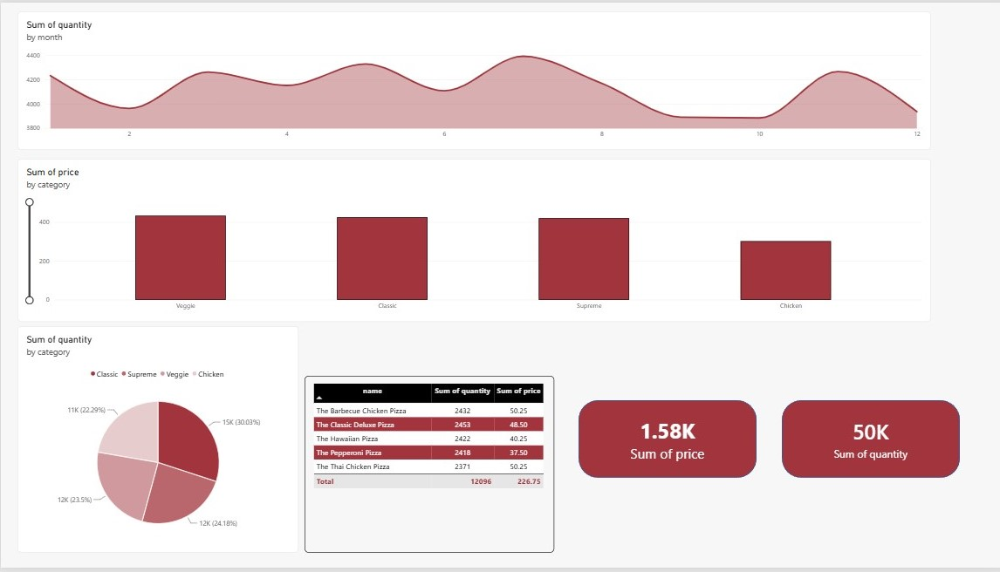
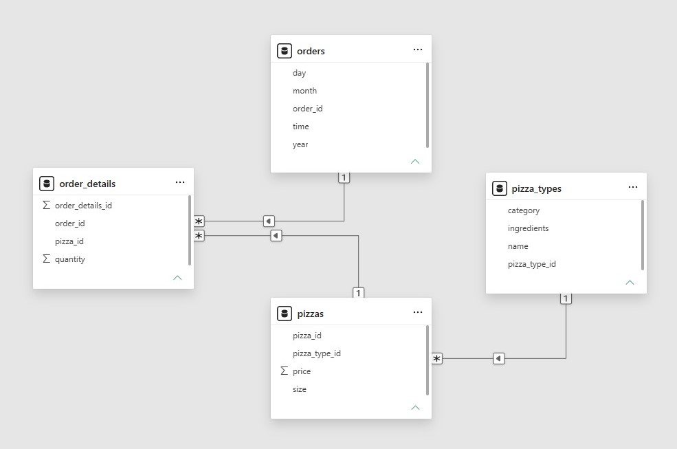
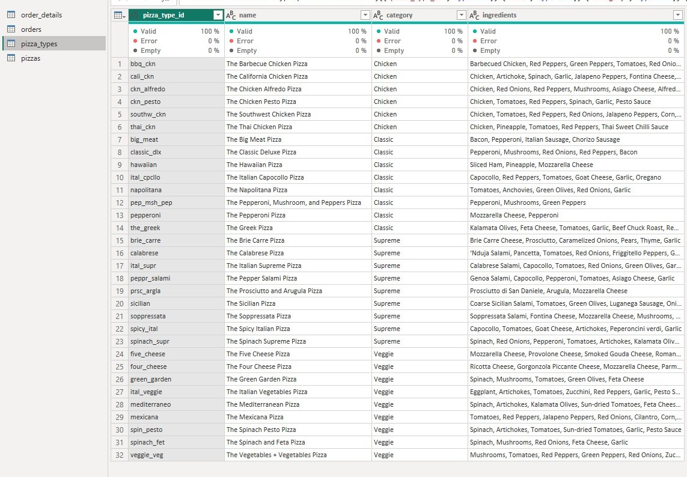

# Pizza Sales Dashboard - Power BI

## Overview
A simple Power BI project created as a practical application of Power BI basics (Power BI 101). The dashboard analyzes pizza sales data to track revenue, sales volume, and product categories.

---

## Dashboard

---

## Data Model
The dataset consists of 4 related tables:
- `orders`: Order ID, date, time.
- `order_details`: Order items and quantity.
- `pizzas`: Pizza ID, size, and price.
- `pizza_types`: Pizza name, category, and ingredients.

---

## Data Preparation
Data was checked and formatted using Power Query to ensure valid types and clean relationships.

---

## Summary Results
- **Total Revenue:** $1,578.30
- **Total Quantity Sold:** 49,574 units
- **Top Selling Category:** Classic (30.03%)
- **Top Selling Item:** The Classic Deluxe Pizza

---

## Tools Used
- Power BI Desktop
- Power Query
